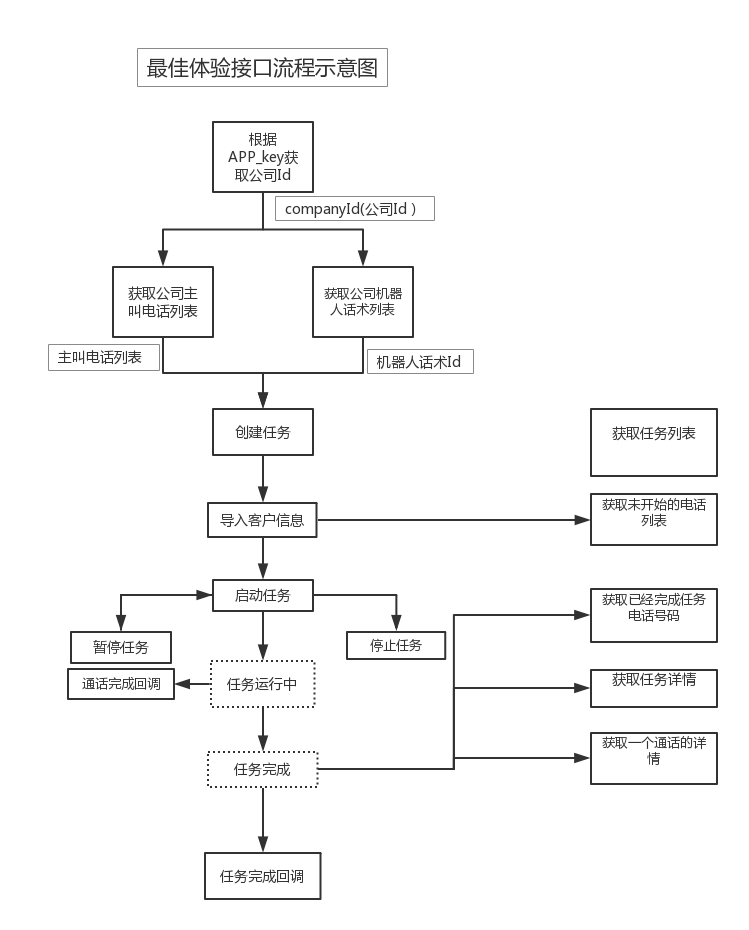

# 介绍
百应机器人API文档

这是百应机器人API文档，具体查看详情每个API接口调用说明；

如果有问题，欢迎联系我们客服，技术支持

公司官网地址 ：

邮箱地址 ：

# 认证    

> 认证密钥样例

```java
  APP_KEY = "WtSMaJWdODxVotvy";
  APP_SECRET = "aXSFnnZbHCVnowXJSROZyJPRMguz1Q";    
```

> 请在API样例`byrobot-openapi-demo`中替换为自己的APP_Key和APP_SECRET.

百应为确保您的账户和信息安全，请在开发对接程序前联系百应技术支持 [注册]() 接口调用专属密钥。

<aside class="notice">
您必须替换对接密钥 <code>APP_KEY 和 APP_SECRET </code>在您的对接程序中 
</aside>

# 开发引导

## 调用说明

百应机器人API是使用HTTP并遵循REST原则设计的Web服务接口；

您可以使用几乎任何客户端和任何编程语言与REST API进行交互。

通过发送简单的HTTP请求就可以轻松接入使用。

## 统一请求格式

URL格式：

<code>/{resource}/{function}</code>

说明： 

{resource}为资源名，通常对应一类API

{function}为该资源提供的操作方法

请求响应的结果为json格式

>比如查询公司列表的url为：
  
```请求URL样例  
<code>http://openapi/v1/company </code> 表示调用company（公司列表）的get方法，并且返回json格式的字符串。

我们目前已经提供的接口，请参考API。 

```

HTTP头信息:

<code>Accept:application/json;charset=utf-8</code>

<code>Content-Type:application/x-www-form-urlencoded;charset=utf-8</code>

说明：

请求方式(Method)：统一用POST方式
编码：UTF-8
最佳实践：

请使用发短信接口
可以自动匹配模板，开发更简单
请设置好IP白名单
IP白名单可以有效提高账户安全性
请补充完整您的账户资料信息
包括设置余额提醒阈值、联系人和紧急联系人的联系方式等账户信息，方便我们提供更好的服务
>

##SDK下载

本页面提供Java的SDK下载。

SDK包内有部分使用说明，各接口的详细使用说明请浏览各API详情页。

如百应未提供您使用语言的SDK，您可以根据API文档开发接口

语言 | GitHub地址 
--------- | ------- 
JAVA | [GitHub地址](https://github.com/indata-public/byrobot-openapi-demo) 


##流程图:

 
